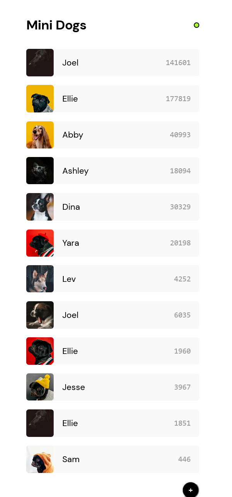

# Mini Dogs 

> Versão da rede social Dogs feita utilizando Redux no curso [Redux com React](https://www.origamid.com/curso/redux-com-react)

### Ajustes e melhorias

Projeto concluído!

- [x] Desenvolvimento de todo o projeto utilizando React + Redux
- [x] Consumo de REST API 

## 💻 Pré-requisitos

Antes de começar, verifique se você atendeu aos seguintes requisitos:

* Você instalou a versão mais recente de `Node.js`

## 🚀 Instalando Mini Dogs

Para instalar o Mini Dogs, siga estas etapas:

* Clone esse repositório com `git clone https://github.com/gguilhermelopes/mini-dogs-redux`
* Entre na pasta com `cd mini-dogs-redux`
* Instale as dependências com `npm install`

## ☕ Usando Mini Dogs

Para usar Mini Dogs, siga estas etapas:

* Certifique-se de que todas as dependências foram instaladas e que esteja na pasta do projeto. Utilize `npm start`
